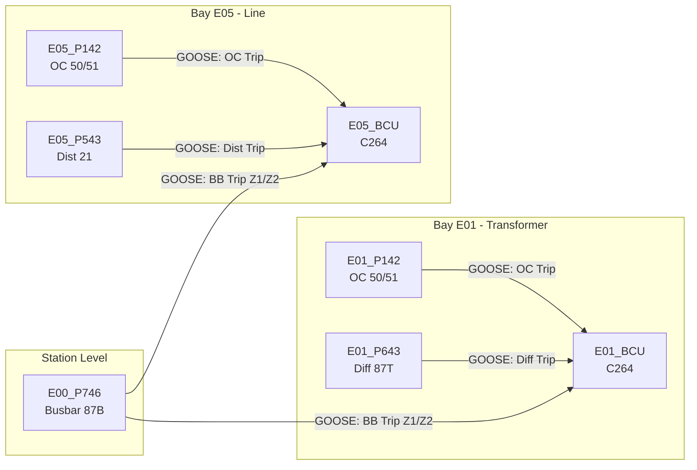

# GI 150kV — Distributed IED Simulation Suite

> A real-time IEC 61850 substation simulator with 18 independent Intelligent Electronic Devices (IEDs), GOOSE peer-to-peer communication, and full protection relay logic.

---

## 1. Project Overview & Scope

This project is a **software-only simulation** of a complete 150kV switchyard for the a Nickel Smelter in Sulawesi, Indonesia. It is designed for:

- **SAS (Substation Automation System) commissioning engineers** to train on IEC 61850 communication workflows before deploying on physical hardware.
- **Protocol developers** to test MMS clients (SCADA HMI, gateway) against a realistic data model.
- **Protection engineers** to verify GOOSE intertrip sequences, auto-reclose logic, and interlocking without energizing a real switchyard.

### Architecture Concept

Each IED (e.g., a protection relay, a bay control unit) runs as its own **standalone `.exe` process**. Every process hosts its own:

- **MMS Server** on a unique TCP port (data model browse, read, write, control).
- **GOOSE Publisher** broadcasting trip/status datasets over raw Ethernet.
- **GOOSE Subscriber** listening for intertrip commands from other IEDs.

### Simulated IED Fleet (18 Executables)

| Bay         | BCU (C264) | Main Protection | Backup Protection |
| :---------- | :--------: | :-------------: | :---------------: |
| E01 TRF-1   |     ✅     | P643 (87T Diff) |  P142 (50/51 OC)  |
| E02 TRF-2   |     ✅     | P643 (87T Diff) |  P142 (50/51 OC)  |
| E03 TRF-3   |     ✅     | P643 (87T Diff) |  P142 (50/51 OC)  |
| E04 Coupler |     ✅     |        —        |  P143 (50/51 OC)  |
| E05 Line-1  |     ✅     | P543 (21 Dist)  |  P142 (50/51 OC)  |
| E06 Line-2  |     ✅     | P543 (21 Dist)  |  P142 (50/51 OC)  |
| E00 Busbar  |     —      |  P746 (87B ×3)  |         —         |

---

## 2. System Architecture

### Layered Design

```
┌─────────────────────────────────────────────────────────────┐
│                    SCADA / HMI Client                       │
│              (MMS Read/Write/Control over TCP)              │
└────────────────────────┬────────────────────────────────────┘
                         │ TCP/IP (one port per IED)
┌────────────────────────▼────────────────────────────────────┐
│  ┌──────────┐  ┌──────────┐  ┌──────────┐  ┌──────────┐     │
│  │ E01_BCU  │  │ E01_P643 │  │ E05_P543 │  │ E00_P746 │     │
│  │ :10201   │  │ :10211   │  │ :10251   │  │ :10200   │     │
│  └──────────┘  └──────────┘  └──────────┘  └──────────┘     │
│         ▲               ▲            ▲            │         │
│         │    GOOSE (L2 Ethernet, EtherType 0x88b8)│         │
│         └───────────────┴────────────┴────────────┘         │
│                    libiec61850 Engine                       │
└─────────────────────────────────────────────────────────────┘
```

### GOOSE Communication Strategy

The simulator uses **IEC 61850 GOOSE** (Generic Object Oriented Substation Event) for sub-4ms peer-to-peer messaging. All GOOSE traffic flows over raw Ethernet frames (Layer 2), bypassing the TCP/IP stack entirely.



**Key Interaction Patterns:**

| Publisher       | Dataset       | Subscribers    | Action                |
| :-------------- | :------------ | :------------- | :-------------------- |
| P746 (Busbar)   | BBTrip Z1, Z2 | All 6 BCUs     | Force CB Open         |
| P643 (Diff)     | DiffTrip      | Local BCU      | Force CB Open + Lock  |
| P543 (Distance) | DistTrip      | Local BCU      | Force CB Open + AR    |
| P142/143 (OC)   | OCTrip        | Local BCU      | Force CB Open         |
| BCU (C264)      | SwitchStatus  | P746 (for CBF) | Breaker Failure Check |

**Interlocking Rules (enforced in each BCU):**

- Manual `close` is **blocked** if an external GOOSE trip is still active (lockout).
- Manual `close` is **blocked** if the earthing switch is closed.
- Earthing switch close is **blocked** if the circuit breaker is closed.

---

## 3. Repository Structure

```text
sas_server/
├── CMakeLists.txt              # Root build file (18 targets)
├── launch_all.bat              # Start all 18 IED processes
├── README.md                   # ← You are here
│
├── src/
│   ├── shared/                 # Common infrastructure library
│   │   ├── ied_server_base.c/h # Server lifecycle, console, tick loop
│   │   ├── ied_config.c/h      # JSON config loader (cJSON)
│   │   ├── goose_handler.c/h   # GOOSE subscribe/publish dispatch
│   │   └── cJSON.c/h           # MIT-licensed JSON parser
│   │
│   ├── relays/                 # Protection & control application logic
│   │   ├── ied_c264_bcu.c      # BCU: CB control, interlocking, GOOSE intertrip
│   │   ├── ied_p543_distance.c # Distance: 4-zone impedance, auto-reclose
│   │   ├── ied_p643_diff.c     # Differential: 87T biased, 87REF, lockout
│   │   ├── ied_p142_overcurrent.c # Overcurrent: 50/51 IDMT curves
│   │   └── ied_p746_busbar.c   # Busbar: 87B sum-of-currents, 3 zones
│   │
│   └── models/                 # CID-generated static IEC 61850 data models
│       ├── E01_BCU.c/h         # One pair per IED (18 total)
│       ├── E01_P643.c/h
│       └── ...
│
├── config/                     # Per-bay runtime configuration
│   ├── E01_TRF1/config/        # E01_BCU.json, E01_P643.json, E01_P142.json
│   ├── E05_LINE1/config/       # E05_BCU.json, E05_P543.json, E05_P142.json
│   └── ...                     # 7 bay directories total
│
├── scripts/                    # Code generation & maintenance tools
│   ├── generate_per_ied_cid.py # CID → static_model.c/h generator
│   └── fix_header_guard.py     # Header guard cleanup utility
│
├── docs/                       # Architecture notes and logs
│
└── legacy/                     # Archived monolithic server code
    ├── sas_server.c            # Original single-process server
    └── fault_engine.c/h        # Original fault injection engine
```

---

## 4. Prerequisites & Build Instructions

### Prerequisites

| Dependency      | Version | Purpose                                      |
| :-------------- | :------ | :------------------------------------------- |
| **MSYS2**       | Latest  | MinGW64 GCC toolchain for Windows            |
| **CMake**       | ≥ 3.16  | Build system generator                       |
| **libiec61850** | 1.5+    | IEC 61850 MMS/GOOSE/SV C library (pre-built) |
| **Npcap**       | 1.7+    | Raw Ethernet capture for GOOSE frames        |

> [!IMPORTANT]
> **Npcap** must be installed in **WinPcap API-compatible mode** for GOOSE to work. Without it, MMS will still function over TCP, but GOOSE publishing/subscribing will fail silently.

### Build Commands

Open an **MSYS2 MinGW64** terminal:

```bash
cd /c/goose/sas_server

# First-time setup
mkdir build_ied && cd build_ied
cmake .. -G "MinGW Makefiles"

# Build all 18 executables
mingw32-make -j4
```

Successful output:

```
[  6%] Built target E01_BCU
[ 12%] Built target E01_P643
        ...
[100%] Built target E00_P746
```

This produces 18 `.exe` files in the `build_ied/` directory.

---

## 5. Configuration Guide

### CID-Based Data Models (`src/models/`)

Each IED's MMS data model is generated from an **IEC 61850 CID** (Configured IED Description) file using the `libiec61850` model generator tool (`genmodel.jar`). The output is a pair of C files (`E01_BCU.c` / `E01_BCU.h`) containing the complete `IedModel`, `LogicalDevice`, `LogicalNode`, `DataObject`, and `DataAttribute` tree as static C structs.

### JSON Runtime Configuration (`config/`)

Each IED reads a JSON file at startup to configure its network identity and protection parameters. The schema has three top-level sections:

```json
{
  "ied_name": "E05_P543", // Unique IED identifier
  "ip": "127.0.0.1", // MMS server bind address
  "port": 10251, // MMS TCP port (unique per IED)
  "goose_interface": "4", // Npcap adapter index for GOOSE

  "protection": {
    // Protection-type-specific settings
    "type": "distance", // "distance" | "differential" | "overcurrent" | "busbar" | "BCU"
    "zone1_reach_ohm": 12.5,
    "zone1_delay_ms": 0,
    "ar_enabled": true,
    "ar_dead_time_ms": 800
  },

  "goose_subscriptions": [
    // What this IED listens to
    {
      "gocbRef": "E00_P746E00P746Z1/LLN0$GO$gcbE00P746Z1",
      "appId": 4097,
      "action": "intertrip_open_cb"
    }
  ]
}
```

### Port Allocation Map

| Bay | BCU Port | Main Prot Port | Backup Prot Port |
| :-- | :------: | :------------: | :--------------: |
| E00 |    —     |     10200      |        —         |
| E01 |  10201   |     10211      |      10221       |
| E02 |  10202   |     10212      |      10222       |
| E03 |  10203   |     10213      |      10223       |
| E04 |  10204   |       —        |      10243       |
| E05 |  10205   |     10251      |      10252       |
| E06 |  10206   |     10261      |      10262       |

---

## 6. Running the Simulation

### Option A: Launch the Entire Substation

From the `build_ied/` directory (as **Administrator**):

```cmd
..\launch_all.bat
```

This opens **18 console windows**, one per IED. Each window provides an interactive command shell.

### Option B: Launch a Single Bay

```cmd
cd build_ied

REM Start only Bay E03 (Transformer 3)
start E03_BCU.exe   ..\config\E03_TRF3\config\E03_BCU.json
start E03_P643.exe  ..\config\E03_TRF3\config\E03_P643.json
start E03_P142.exe  ..\config\E03_TRF3\config\E03_P142.json
```

### Interactive Console Commands

Each IED type provides different commands:

| Relay Type                 | Commands                                                |
| :------------------------- | :------------------------------------------------------ |
| **BCU** (C264)             | `open`, `close`, `earth on`, `earth off`, `status`      |
| **Busbar** (P746)          | `inject bb-z1`, `inject bb-z2`, `inject bb-cz`, `reset` |
| **Distance** (P543)        | `inject ph-e 1`, `inject ph-ph 2`, `reset`              |
| **Differential** (P643)    | `inject 87T`, `inject 87REF`, `reset`                   |
| **Overcurrent** (P142/143) | `inject <amps>` (e.g., `inject 3000`), `reset`          |

### Example: End-to-End Fault Test

1. **Start the bay:** Launch `E03_BCU`, `E03_P643`, and `E03_P142`.
2. **Inject a fault:** In the `E03_P643` window, type `inject 87T`.
3. **Observe the trip:** The P643 logs `87T DIFFERENTIAL TRIP (10ms)` and sends a GOOSE frame.
4. **BCU receives intertrip:** The BCU logs `[GOOSE RX] Intertrip received — opening CB`.
5. **Verify interlocking:** In the BCU, type `close`. It prints `INTERLOCKING BLOCKED — external GOOSE trip active (lockout)`.
6. **Clear the fault:** In `E03_P643`, type `reset`. Now `close` in the BCU succeeds.

---

## License

This simulator is built on top of [libiec61850](https://github.com/mz-automation/libiec61850) (GPLv3). The simulation application logic is proprietary to the GI 150kV project.
